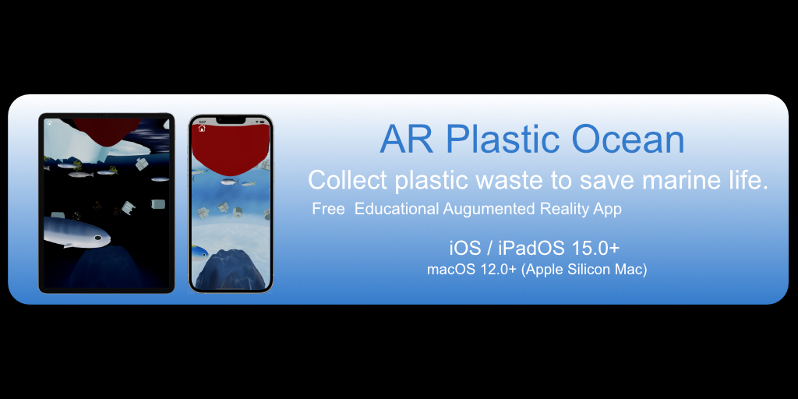
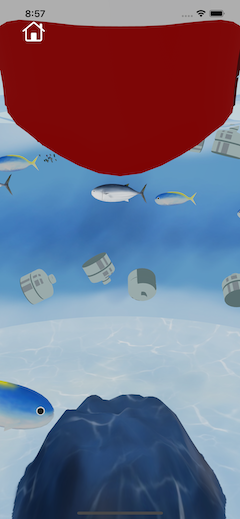
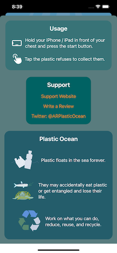
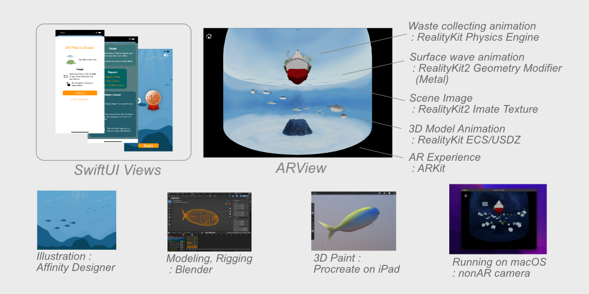
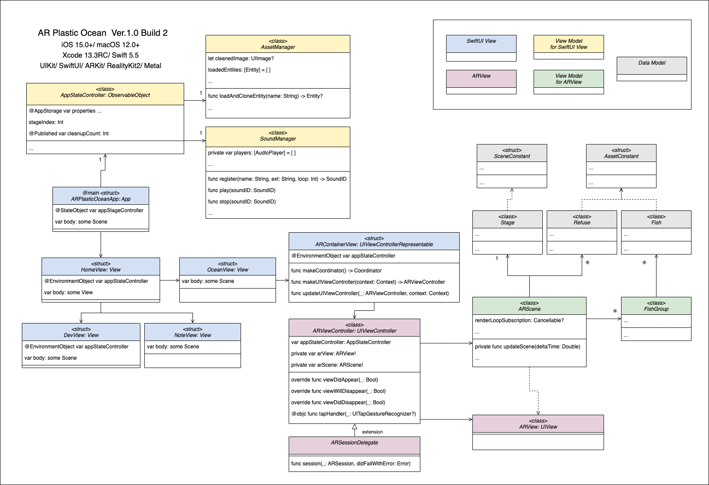

# iOS app: AR Plastic Ocean

This is an educational iOS app aimed at getting people interested in marine plastic pollution.

- It displays 3D ocean scenes in AR, with fish swimming and floating plastic debris.
- Fish die because of plastic waste. Users can tap to collect garbage and help fish.

## Requirements

- Xcode 14.1+
- iOS 15.0+ / iPadOS 15.0+ / macOS 12.0+ (with Apple Silicon)

## Builds

- Ver.1.0 (Build 3): released on March 16, 2022.
- Ver.1.1/1.2 (Build 4-8): added some localization support.
- Ver.1.3 (Build 9): fixed an issue about device rotation on iOS 16/iPadOS 16.
- Ver.1.4 (Build 10): added Polish support.
- Ver.1.5 (Build 11): added Vietnamese support. Merged the PR by Dan Tong.

DevView

- In DEBUG builds, you can open DevView by tapping the space (invisible) to the left of the sound button.

Licensed Music Files

- Licensed music files were replaced with the `wave1.mp4` file.

## Contributions

- Localizable strings and InfoPlist strings in Italian was translated by Matteo Spada.
- Localizable strings in French was revised by Maxime Maisonneuve and Gregoire Lemoulant. 
- Localizable strings in German was revised by Andreas Schallwig and Lena.
- Localizable strings and InfoPlist strings in Burmese was translated by Kyaw Zay Ya Lin Tun.
- Localizable strings and InfoPlist strings in Korean was translated by James.
- Localizable strings and InfoPlist strings in Spanish was translated by Agustin Mendoza.
- Localizable strings and InfoPlist strings in Chinese, Traditional was translated by Jack.
- Localizable strings and InfoPlist strings in Polish was translated by Bartosz Król.
- Localizable strings and InfoPlist strings in Vietnamese was provided by Dan Tong.

## Frameworks

- SwiftUI, ARKit
- RealityKit: Physics Engine, Geometry Modifier (Metal Shader), Image Texture

## Specific Identifiers

The `AppConstant.swift` file defines a few specific identifiers such as `https://www.atarayosd.com/`, `https://apps.apple.com/app/id1614059602`, and `https://twitter.com/ARPlasticOcean`.
Please replace them with your own.

## License

- MIT
